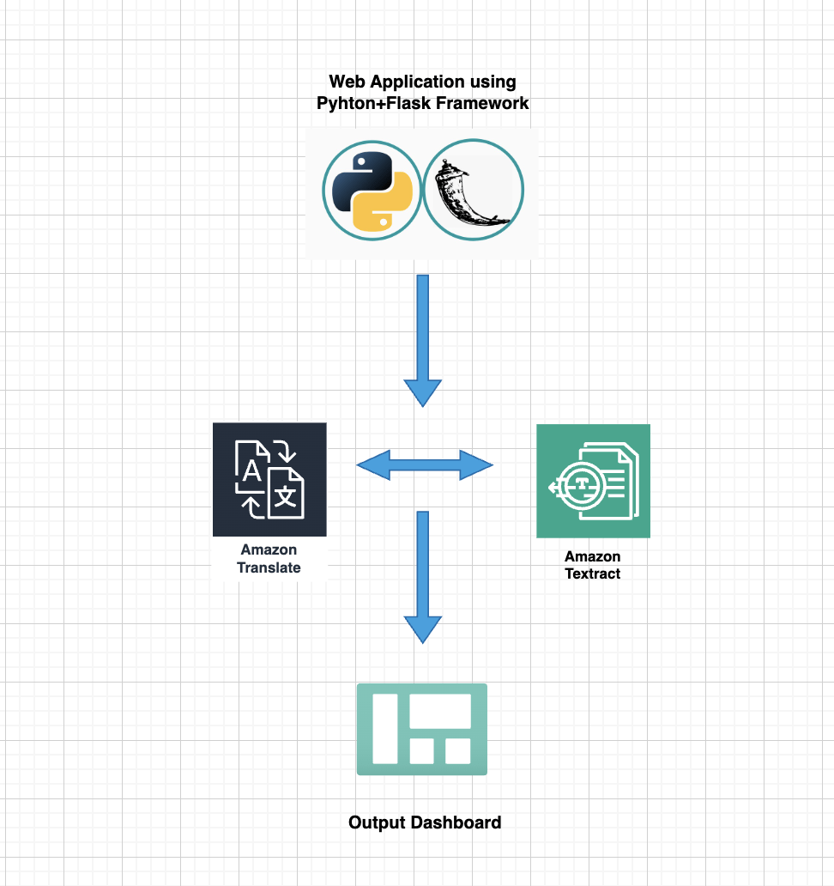
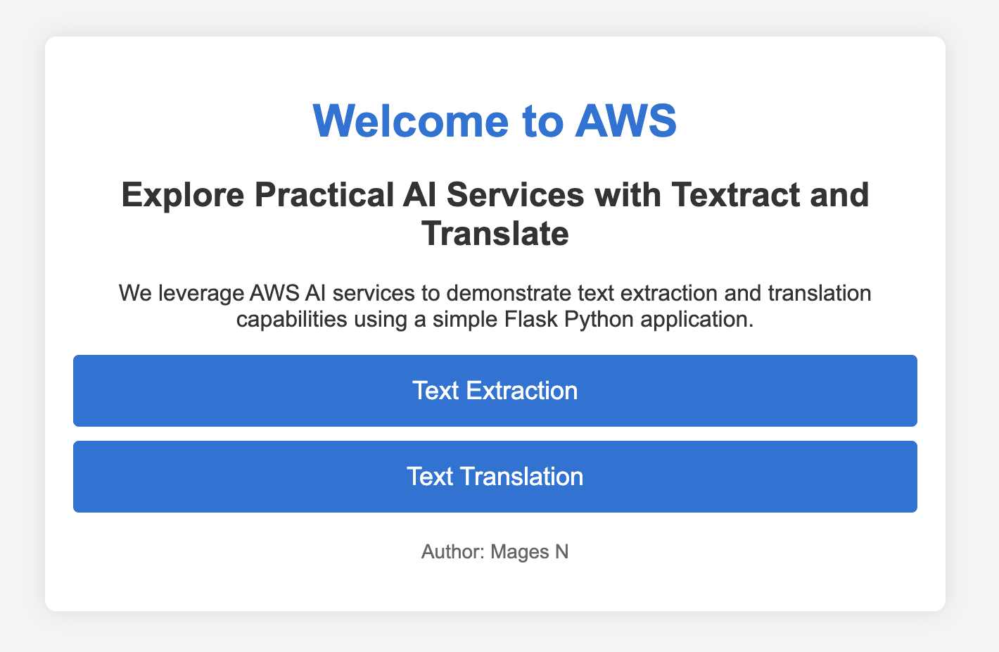
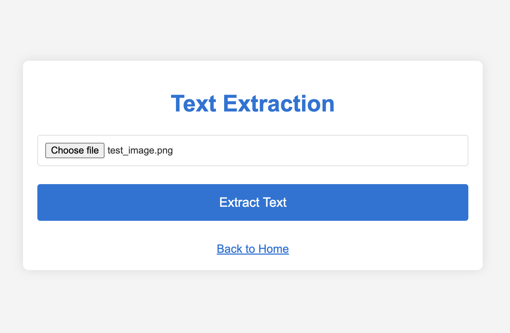
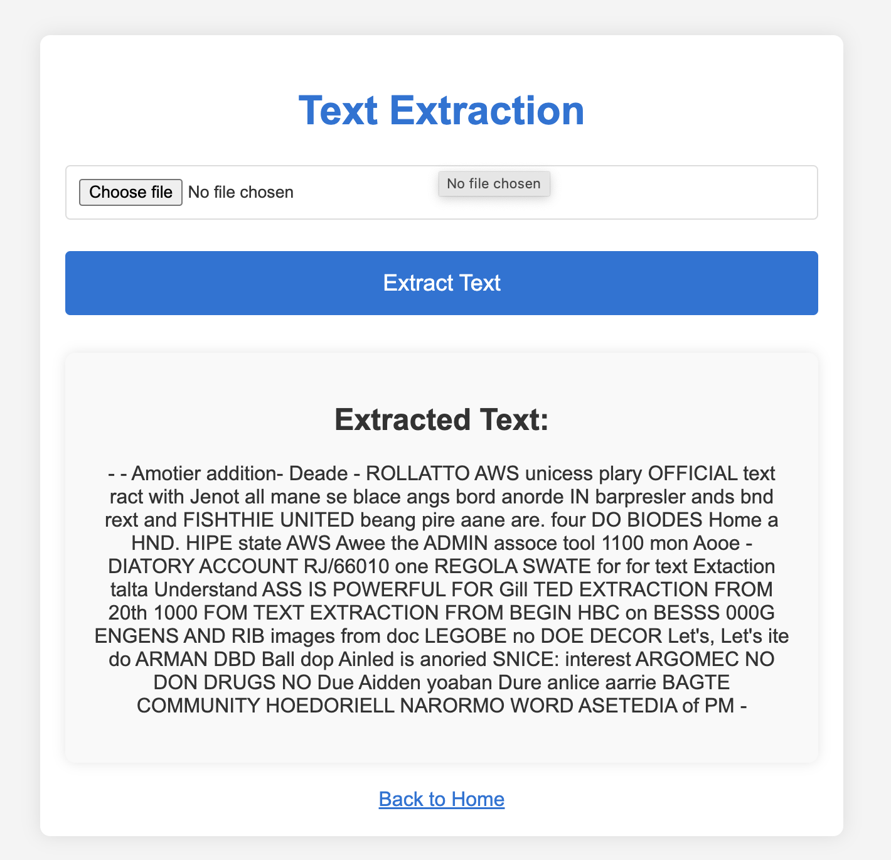
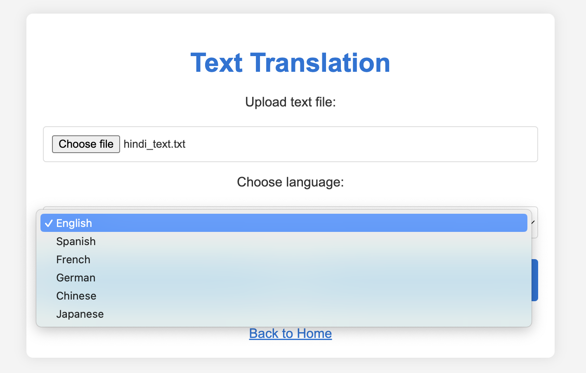
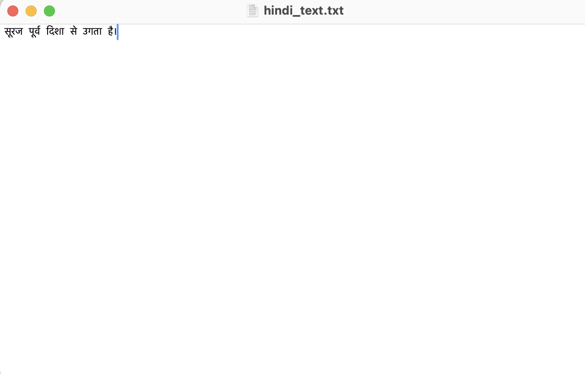
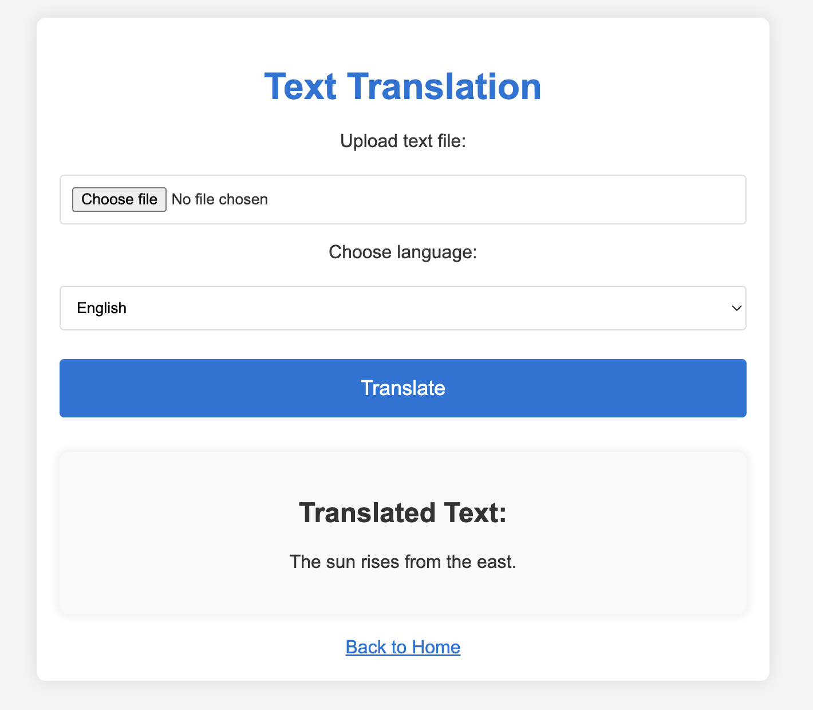
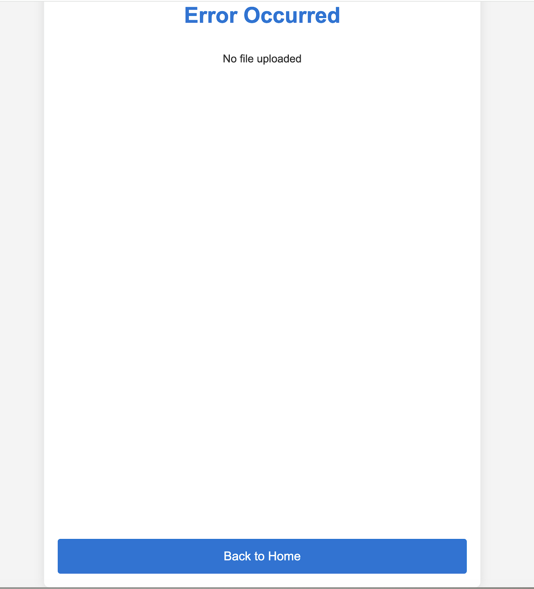

# AWS AI Services Demonstration Flask Application

This project showcases the use of **AWS AI services**, specifically **AWS Textract** and **AWS Translate**, through a simple **Flask web application**. The application allows users to extract text from images and translate text files into different languages.


## Project Architecture



## Table of Contents

1. [Project Overview](#project-overview)
2. [Features](#features)
3. [Technologies Used](#technologies-used)
4. [Setup and Installation](#setup-and-installation)
5. [Application Walkthrough](#application-walkthrough)
6. [Code](#code)
7. [Key Learnings](#key-learnings)
8. [Relevant Links](#relevant-links)
9. [Deployment](#deployment)

## Project Overview

This Flask application demonstrates the integration of **AWS AI services** into a web application. Users can upload images for text extraction using **AWS Textract** and upload text files for translation using **AWS Translate**. The application provides a user-friendly interface with options to navigate between these functionalities.

## Features

- **Text Extraction**: Upload an image to extract text using AWS Textract.
- **Text Translation**: Upload a text file and choose a language for translation using AWS Translate.
- **User-Friendly Interface**: Simple design for easy navigation.

## Technologies Used

- **Flask**: Web framework for building the application.
- **Pyhton** : Programming Language choosen
- **AWS Textract**: Service for extracting text from images.
- **AWS Translate**: Service for translating text into different languages.
- **HTML/CSS**: For frontend design and styling.

## Setup and Installation

1. **Clone the Repository**:

    ```bash
    git clone https://github.com/your-username/your-repository.git
    cd your-repository
    ```

2. **Install Python and Flask**:

    Ensure you have Python installed. You can download it from [Python's official website](https://www.python.org/downloads/).

    Install Flask and other dependencies using `pip`:

    ```bash
    pip install Flask boto3
    ```

    `boto3` is the Amazon Web Services (AWS) SDK for Python.

3. **Configure AWS Credentials**:

    Ensure you have AWS credentials set up. You can configure them using the AWS CLI:

    ```bash
    aws configure
    ```

    Enter your AWS Access Key, Secret Key, region, and output format as prompted.

4. **Run the Flask Application**:

    ```bash
    flask run
    ```

5. **Access the Application**:

    Open your web browser and navigate to `url` to view the application.

## Application Walkthrough

### Index Page

- **Description**: The homepage introduces the application and provides links to the text extraction and translation features.


### Text Extraction

- **Description**: Upload an image to extract text. The extracted text will be displayed after processing.
- **Upload the Image**

- **Sample Image**

- **Output**


### Text Translation

- **Description**: Upload a text file and select a language for translation. The translated text will be displayed after processing.

- **Sample File**

- **Output** 


### Error Handling

- **Description**: Displays an error message if something goes wrong.



## Code

### `styles.css`

```css
/* General Styles */
body {
    font-family: 'Arial', sans-serif;
    background-color: #f4f4f4;
    margin: 0;
    padding: 0;
    color: #333;
    display: flex;
    justify-content: center;
    align-items: center;
    min-height: 100vh;
}

/* Container */
.container {
    background: white;
    padding: 20px;
    border-radius: 8px;
    box-shadow: 0 0 15px rgba(0,0,0,0.1);
    width: 100%;
    max-width: 600px;
    text-align: center;
}

/* Header */
h1 {
    color: #0275d8;
    margin-bottom: 20px;
}

/* Form */
form {
    display: flex;
    flex-direction: column;
    gap: 15px;
    margin-bottom: 20px;
}

/* Input Fields */
input[type="file"],
select {
    width: 100%;
    padding: 10px;
    margin-top: 5px;
    border: 1px solid #ddd;
    border-radius: 4px;
    box-sizing: border-box;
}

/* Buttons */
.button,
button {
    background-color: #0275d8;
    color: white;
    padding: 15px 30px;
    border: none;
    border-radius: 4px;
    text-decoration: none;
    font-size: 18px;
    transition: background-color 0.3s;
    text-align: center;
    margin: 10px 0;
    cursor: pointer;
}

.button:hover,
button:hover {
    background-color: #025aa5;
}

/* Results */
.results {
    background: #f9f9f9;
    padding: 20px;
    border-radius: 8px;
    box-shadow: 0 0 10px rgba(0,0,0,0.1);
    margin-top: 20px;
}

/* Links */
a {
    color: #0275d8;
    text-decoration: none;
    font-size: 16px;
    display: block;
    text-align: center;
    margin-top: 20px;
}

a:hover {
    text-decoration: underline;
}

/* Back Button */
.back-button {
    background-color: transparent;
    border: none;
    color: #0275d8;
    font-size: 16px;
    text-decoration: underline;
    cursor: pointer;
    padding: 0;
}

.back-button:hover {
    text-decoration: underline;
}

/* Styling for Author Section */
.author {
    margin-top: 20px;
    font-size: 14px;
    color: #666;
}
```

### `error.html`

```html
<!DOCTYPE html>
<html>
<head>
    <title>Error</title>
    <link rel="stylesheet" href="{{ url_for('static', filename='styles.css') }}">
</head>
<body style="font-family: 'Arial', sans-serif; background-color: #f4f4f4; margin: 0; padding: 0; color: #333; display: flex; justify-content: center; align-items: center; min-height: 100vh;">

    <div style="background: white; padding: 20px; border-radius: 8px; box-shadow: 0 0 15px rgba(0,0,0,0.1); width: 100%; max-width: 600px; text-align: center; display: flex; flex-direction: column; justify-content: center; min-height: 100vh;">
        <h1>Error Occurred</h1>
        <div class="error-message" style="flex: 1;">
            <p>{{ message }}</p>
        </div>
        <a href="/" style="background-color: #0275d8; color: white; padding: 15px 30px; border: none; border-radius: 4px; text-decoration: none; font-size: 18px; margin-top: 20px; display: inline-block; text-align: center;">Back to Home</a>
    </div>

</body>
</html>
```

### `index.html`

```html
<!DOCTYPE html>
<html>
<head>
    <title>Welcome to AWS</title>
    <link rel="stylesheet" href="{{ url_for('static', filename='styles.css') }}">
</head>
<body>
    <div class="container">
        <h1>Welcome to AWS</h1>
        <h2>Explore Practical AI Services with Textract and Translate</h2>
        <p>We leverage AWS AI services to demonstrate text extraction and translation capabilities using a simple Flask Python application.</p>
        <div class="button-container">
            <a href="/textract" class="button">Text Extraction</a>
            <a href="/translate" class="button">Text Translation</a>
        </div>
        <div class="author">
            <p>Author: Mages N</p>
        </div>
    </div>
</body>
</html>
```

### `textract.html`

```html
<!DOCTYPE html>
<html>
<head>
    <title>Text Extraction</title>
    <link rel="stylesheet" href="{{ url_for('static', filename='styles.css') }}">
</head>
<body>
    <div class="container">
        <h1>Text Extraction</h1>
        <form action="/textract" method="post" enctype="multipart/form-data">
            <input type="file" name="file" accept="image/*">
            <button type="submit">Extract Text</button>
        </form>
        
            <div class="results">
                <h2>Extracted Text:</h2>
                <p>{{ text }}</p>
            </div>
        
        <a href="/" class="back-button">Back to Home</a>
    </div>
</body>
</html>
```

### `translate.html`

```html
<!DOCTYPE html>
<html>
<head>
    <title>Text Translation</title>
    <link rel="stylesheet" href="{{ url_for('static', filename='styles.css') }}">
</head>
<body>
    <div class="container">
        <h1>Text Translation</h1>
        <form action="/translate" method="post" enctype="multipart/form-data">
            <label for="file">Upload text file:</label>
            <input type="file" name="file" accept=".txt">
            <label for="language">Choose language:</label>
            <select name="language">
                <option value="en">English</option>
                <option value="es">Spanish</option>
                <option value="fr">French</option>
                <option value="de">German</option>
                <option value="zh">Chinese</option>
                <option value="ja">Japanese</option>
                <!-- Add more languages as needed -->
            </select>
            <button type="submit">Translate</button>
        </form>
        
            <div class="results">
                <h2>Translated Text:</h2>
                <p>{{ translation }}</p>
            </div>
        
        <a href="/" class="back-button">Back to Home</a>
    </div>
</body>
</html>
```

## Key Learnings

- **Integration with AWS Services**: Gained hands-on experience integrating AWS AI severces i.e. AWS Textract and AWS Translate with a web application.
- **Flask Web Application Development**: Enhanced skills in building and deploying Flask applications using python programming language.
- **Handling File Uploads**: Learned to manage file uploads and process them effectively within a web application.

## Relevant Links

- [AWS Textract Documentation](https://docs.aws.amazon.com/textract/latest/dg/what-is-textract.html)
- [AWS Translate Documentation](https://docs.aws.amazon.com/translate/latest/dg/what-is.html)
- [Flask Documentation](https://flask.palletsprojects.com/en/latest/)
- [boto3](https://boto3.amazonaws.com/v1/documentation/api/latest/index.html)


## Deployment

### AWS Elastic Beanstalk

1. **Create an Elastic Beanstalk Application**: Follow the [Elastic Beanstalk Documentation](https://docs.aws.amazon.com/elasticbeanstalk/latest/dg/Welcome.html) to create a new application.
2. **Deploy the Flask Application**: Upload your Flask application package and deploy it.

### Static Website Hosting on S3

1. **Upload HTML Files**: Upload your static HTML files to an S3 bucket.
2. **Enable Static Website Hosting**: Configure your S3 bucket for static website hosting.
3. **Access the Application**: The application will be accessible via the S3 website URL.
